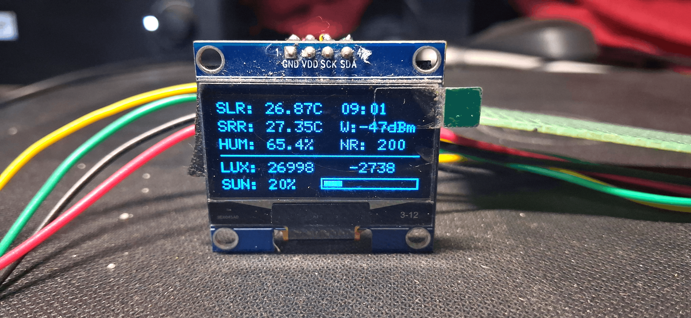
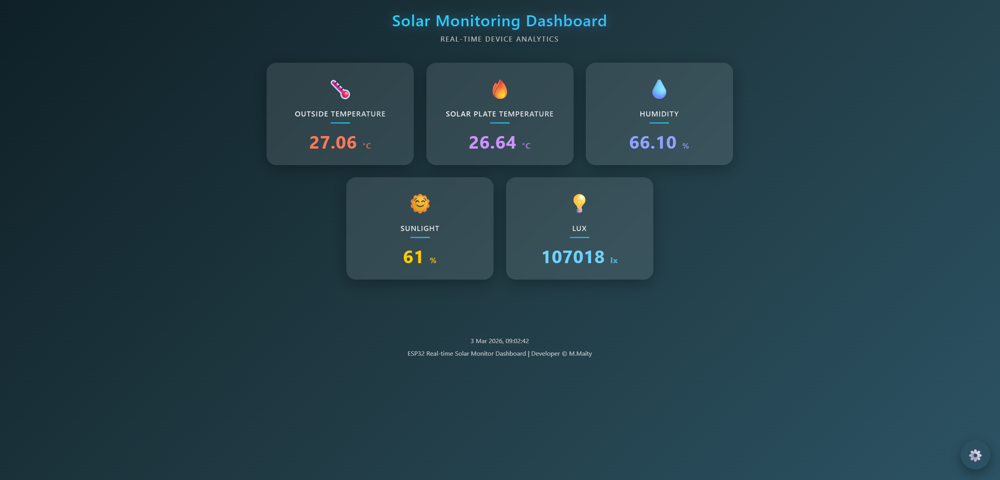
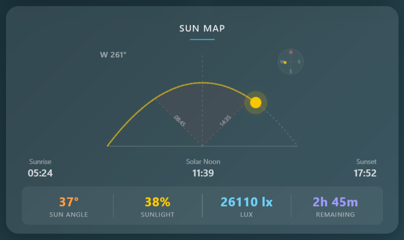
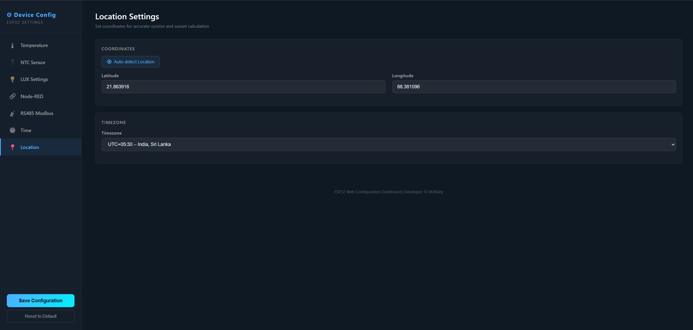

# Solar Panel Smart Monitoring System

**Dual ESP32 | RS485 Modbus | Web Dashboard | Node-RED**

Industrial-grade solar monitoring with real-time sensor data, OLED display, and full web configuration.

---

## Project Preview

|     OLED Display     |          Dashboard          |        Sun Map         |      Config Page      |
| :------------------: | :-------------------------: | :--------------------: | :-------------------: |
|  |  |  |  |

---

## Demo

**Watch Full Working Demo:**
[Demo 1](https://youtu.be/VbW-eC95sSU) |
[Demo 2](https://youtu.be/SrXycDGpsag) |
[Demo 3](https://youtu.be/nSapfp4AQMc) |
[Demo 4](https://youtu.be/mzdl66dy0Fc)

---

## System Architecture

```
SENDER (Slave ESP32)        RECEIVER (Master ESP32)
  - NTC Thermistor             - AHT10 Temp/Humidity
  - BH1750 LUX                - OLED Display
  - LED Feedback               - WiFi + Web UI
                               - Node-RED Link
        |                      - LED Feedback
        |    RS485 Modbus           |
        |    (Half-Duplex)          |
        +<========115200=======>+   |
                                    v
                              Web Browser
                          (Dashboard + Config)
```

---

## Features

**Communication**

- RS485 Modbus RTU half-duplex between two ESP32s
- Function 0x03 — Master polls sensor data from slave
- Function 0x10 — Master pushes config to slave
- Auto garbage byte stripping + CRC validation
- LED feedback on both modules (TX/RX blink)

**Sensors**

| Parameter           | Sensor     | Module   |
| ------------------- | ---------- | -------- |
| Panel Temperature   | NTC 10K    | Sender   |
| Ambient Temperature | AHT10      | Receiver |
| Humidity            | AHT10      | Receiver |
| Light Intensity     | BH1750     | Sender   |
| Sunlight %          | Calculated | Receiver |
| WiFi Strength       | RSSI       | Receiver |

**Display**

- 128x64 OLED with WiFi bars, sunlight bar, LUX trend, 12H/24H clock

**Web Interface**

- Real-time dashboard with all sensor values
- Interactive Sun Map (NOAA formula, compass, sunrise/sunset)
- Full configuration portal
- GPS auto-detect for location
- 40+ timezone options
- Save/Reset syncs to both master & slave NVS
- Responsive design (desktop, tablet, mobile)
- Async non-blocking web server

**Node-RED**

- HTTP POST data sharing with configurable interval
- Enable/disable from web config

---

## How It Works

### Data Polling

```
RECEIVER (Master)          SENDER (Slave)
     |                          |
     |--- Modbus 0x03 req ----->|
     |    (4 registers)         |
     |                     Reads sensors
     |<--- Response ------------|
     |    ntcTemp, luxValue,    |
     |    luxConnected,         |
     |    modbusInterval        |
     |                          |
     | (wait modbusInterval)    |
     |--- repeat -------------->|
```

### Settings Sync

```
RECEIVER (Master)          SENDER (Slave)
     |                          |
  User clicks Save/Reset       |
  Saves to own NVS             |
     |                          |
     |--- Modbus 0x10 -------->|
     |    (9 registers)    Saves to NVS
     |                          |
     |<--- Confirmation --------|
     |                          |
  LED glows 1s             LED glows 1s
```

---

## Pin Configuration

**RECEIVER (Master)**

| Component   | Function           | GPIO |
| ----------- | ------------------ | ---- |
| RS485 RO    | UART RX            | 16   |
| RS485 DI    | UART TX            | 17   |
| RS485 DE/RE | Direction          | 4    |
| OLED SDA    | I2C Data           | 21   |
| OLED SCL    | I2C Clock          | 22   |
| AHT10 SDA   | I2C Data (shared)  | 21   |
| AHT10 SCL   | I2C Clock (shared) | 22   |
| Status LED  | Feedback           | 2    |

**SENDER (Slave)**

| Component      | Function  | GPIO |
| -------------- | --------- | ---- |
| RS485 RO       | UART RX   | 20   |
| RS485 DI       | UART TX   | 21   |
| RS485 DE/RE    | Direction | 4    |
| BH1750 SDA     | I2C Data  | 21   |
| BH1750 SCL     | I2C Clock | 22   |
| NTC Thermistor | ADC Input | 0    |
| Status LED     | Feedback  | 2    |

> **Note:** On the Sender, GPIO 21 is shared between RS485 TX and I2C SDA. Ensure your board supports this or remap.

---

## Circuit Diagram

**ESP32 to MAX485 (both modules)**

| ESP32   | MAX485         |
| ------- | -------------- |
| GPIO TX | DI             |
| GPIO RX | RO             |
| GPIO EN | DE + RE (tied) |
| 3.3V    | VCC            |
| GND     | GND            |

**RS485 Bus (between modules)**

| Receiver MAX485 | Sender MAX485    |
| --------------- | ---------------- |
| A               | A (twisted pair) |
| B               | B (twisted pair) |
| GND             | GND (common)     |

**Receiver I2C Bus (GPIO 21 SDA, GPIO 22 SCL)**

- SH1106 OLED 128x64
- AHT10 Temp/Humidity

**Sender I2C Bus (GPIO 21 SDA, GPIO 22 SCL)**

- BH1750 LUX Sensor

### NTC Thermistor Voltage Divider (Sender)

```
3.3V --- [NTC 10K] --- GPIO 0 --- [10K Resistor] --- GND
```

---

## Configurable Settings

| Setting           | Default | Description                  |
| ----------------- | ------- | ---------------------------- |
| NTC Resistance    | 10000 Ω | Nominal resistance           |
| Beta Constant     | 3435    | NTC beta coefficient         |
| NTC Offset        | 0.0 °C  | Temperature calibration      |
| NTC Interval      | 1 sec   | Reading frequency            |
| LUX Interval      | 1 sec   | Light reading frequency      |
| RS485 Enable      | On      | Modbus polling toggle        |
| Device ID         | 1       | Modbus slave address (1-247) |
| Baud Rate         | 115200  | RS485 speed                  |
| Modbus Interval   | 2 sec   | Polling frequency            |
| Node-RED Enable   | Off     | Data sharing toggle          |
| Node-RED IP       | —       | Target server                |
| Node-RED Port     | 1880    | Target port                  |
| Node-RED Interval | 10 sec  | Push frequency               |
| GMT Offset        | 19800   | Timezone in seconds (IST)    |
| Clock Format      | 24      | 12H or 24H display           |
| Latitude          | 0.0     | GPS auto-detect supported    |
| Longitude         | 0.0     | GPS auto-detect supported    |
| Timezone Offset   | 5.5     | UTC offset (dropdown)        |

---

## Project Structure

```
SOLAR_TRACKING_RS485/
├── RECEIVER/
│   ├── RECEIVER.ino       # Master ESP32
│   └── data/
│       ├── index.html     # Web Dashboard
│       └── config.html    # Config Portal
├── SENDER/
│   └── SENDER.ino         # Slave ESP32
├── display.png
├── dashboard.png
├── config.png
├── LICENSE
└── README.md
```

---

## Hardware Required

| #   | Component              | Qty | Used By   |
| --- | ---------------------- | --- | --------- |
| 1   | ESP32 Dev Board        | 2   | Both      |
| 2   | MAX485 RS485 Module    | 2   | Both      |
| 3   | SH1106 128x64 OLED     | 1   | Receiver  |
| 4   | AHT10 Temp/Humidity    | 1   | Receiver  |
| 5   | BH1750 LUX Sensor      | 1   | Sender    |
| 6   | NTC 10K Thermistor     | 1   | Sender    |
| 7   | 10K Resistor           | 1   | Sender    |
| 8   | LEDs (or onboard)      | 2   | Both      |
| 9   | Twisted Pair Cable     | 1   | RS485 bus |
| 10  | 5V / 3.3V Power Supply | 2   | Both      |

---

## Libraries Required

| Library           | Purpose            |
| ----------------- | ------------------ |
| WiFi.h            | WiFi               |
| WiFiManager       | Auto config portal |
| ESPAsyncWebServer | Async web server   |
| ArduinoJson       | JSON               |
| U8g2lib           | OLED driver        |
| Adafruit_AHT10    | Temp/humidity      |
| BH1750            | LUX sensor         |
| Preferences       | NVS storage        |
| HardwareSerial    | RS485 UART         |
| Dusk2Dawn         | Sunrise/sunset     |

---

## Sun Map

The dashboard Sun Map uses the **NOAA Solar Position Algorithm** to calculate real-time sun position from your latitude, longitude, and timezone.

**Calculations:**

- Solar Declination — Earth's tilt relative to sun
- Equation of Time — elliptical orbit correction
- Hour Angle — angular position vs solar noon
- Elevation Angle — height above horizon (0°–90°)
- Azimuth Angle — compass bearing (0°N, 90°E, 180°S, 270°W)
- 45° Crossing Times — binary search for optimal panel angle

---

## Getting Started

**1. Clone**

```bash
git clone https://github.com/iotBrainStorm/SOLAR_TRACKING_RS485.git
```

**2. Flash SENDER**

- Open `SENDER/SENDER.ino` in Arduino IDE
- Select ESP32 board & COM port → Upload

**3. Flash RECEIVER**

- Open `RECEIVER/RECEIVER.ino` in Arduino IDE
- Upload SPIFFS data: `Tools → ESP32 Sketch Data Upload`
- Upload the sketch

**4. Connect WiFi**

- First boot creates AP: **"Solar Weather"**
- Connect and set WiFi at `192.168.4.1`

**5. Open Dashboard**

- `http://<receiver-ip>/` — Dashboard
- `http://<receiver-ip>/config.html` — Config

---

## Reliability

- CRC-16 validation on every Modbus frame
- Auto garbage byte detection and stripping
- Bus watchdog recovery (30s timeout)
- HTTP timeout for Node-RED
- WiFi auto-reconnect with fallback AP
- NVS persistent storage (survives power cycles)
- Sender RS485 always enabled (can't be bricked)

---

## Future Plans

- Hardware Watchdog Timer
- OTA Firmware Update
- Dust/Rain Sensor
- Cloud Backup (MQTT / Firebase)
- Deep Sleep Mode
- SD Card Logging
- Historical Charts

---

## License

This project is licensed under the [MIT License](LICENSE).

---

## Developed By

**Mrinal Maity**

ESP32 Solar Monitoring System with RS485 Modbus

---

Star this repo if you found it useful! | Fork to customize | Share with fellow makers

## 💎 Extra Professional Touch (Optional Additions)

<ul>
	<li>🏷️ GitHub badges (ESP32, Arduino, License)</li>
	<li>🎞️ Animated GIF demo</li>
	<li>🗂️ Block diagram</li>
	<li>📊 Feature comparison table</li>
	<li>📝 Version changelog</li>
	<li>📄 License section</li>
</ul>
